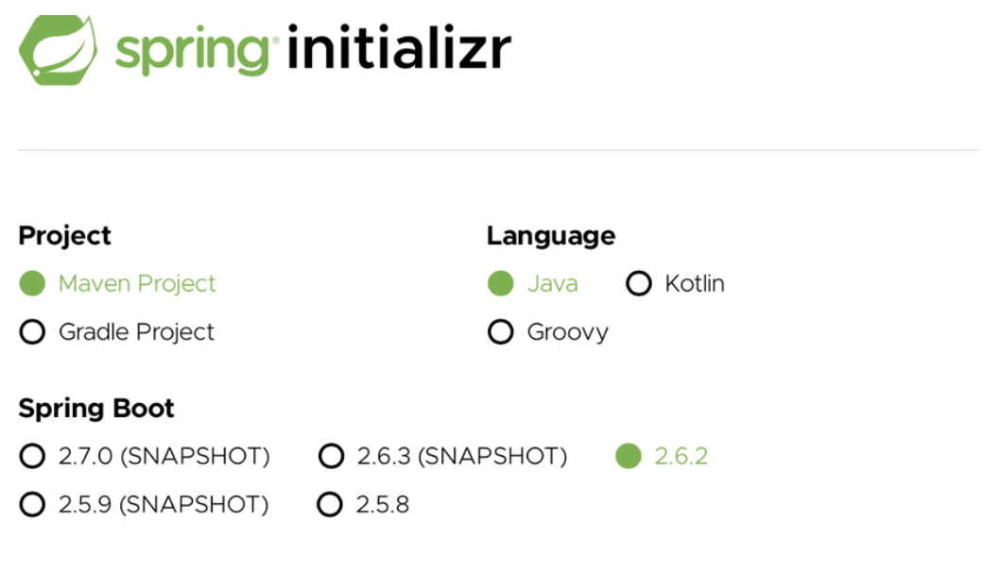
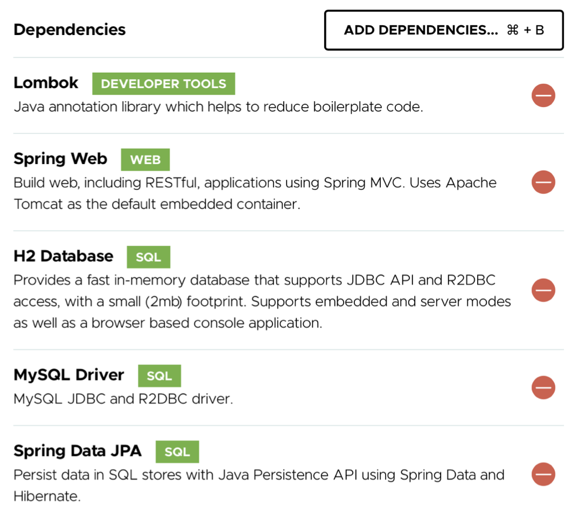
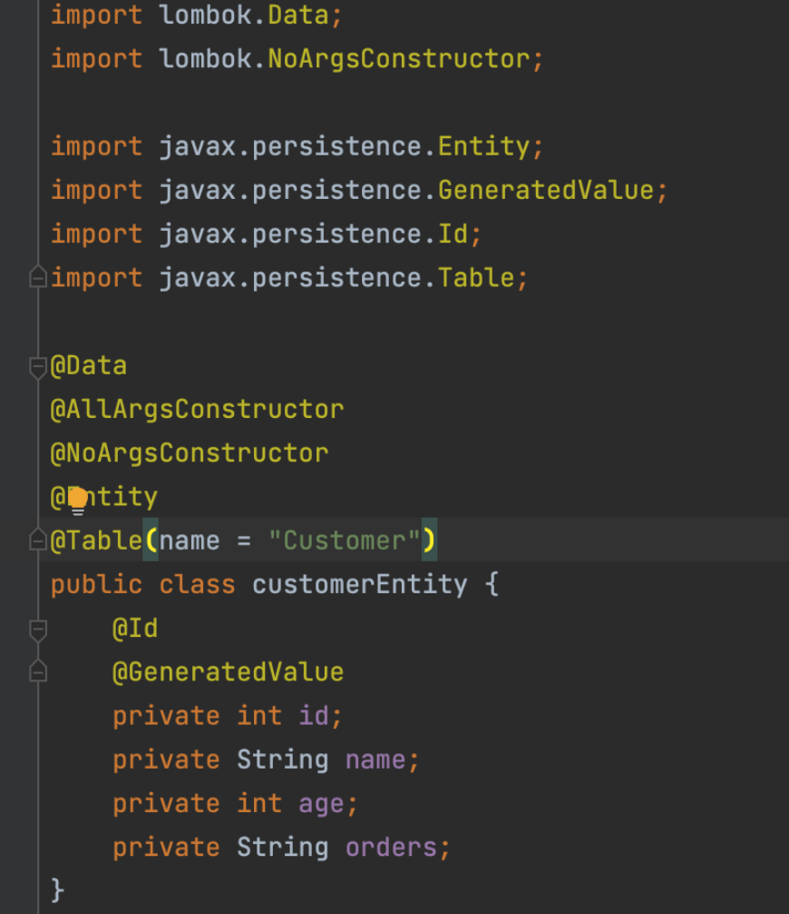
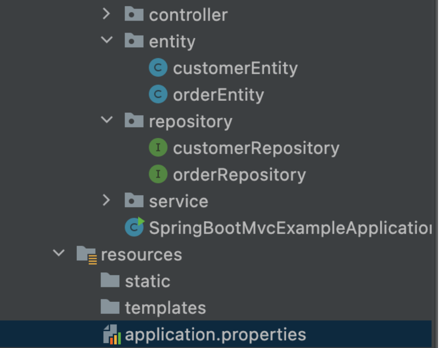

## 🗃️ **Creating structures in MySQL database with Spring MVC architecture**
In this repository, a Spring MVC application will be implemented. For this, a different Java project will be opened and Spring Initializr must be used. Since the Spring Initializr did not appear on the Intellij IDEA screen, help was taken from the website.

### 🎡 **Architecture**
     📲 Model : Service and Repository File
     📽 View : Entity File
     🪛 Controller: Controller File

### 🐣 **Steps**

🌖 The libraries to be used for the study were also added from the same command screen as seen in the Figure. These dependencies have been **Lombok, Spring Web, H2 Database, MySQL Driver and Spring Data JPA**.

🌗 As seen in the main file in the code, many different packages have been created within the project. There will be 2 tables, Order and Customer, in the database and these tables will be connected to each other.

🌘 Then, as shown in the figure below, the properties of the Customer class in the entity package are introduced according to the ones given in the table. Other entity, controller, repository and service packages are also defined, respectively.

🌔 In the next step, as seen in the figure below, the process is performed in the file required for the database connection. Database connections are provided in the application.properties file in the Resources file.

